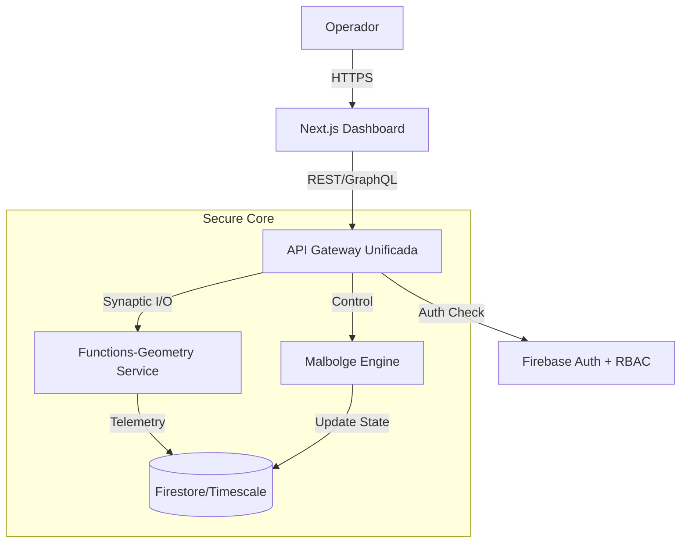

# RFC-001: Definición del Alcance Funcional del Dashboard de Observabilidad (The Eye)

**Estado:** Propuesta para Revisión  
**Fecha:** 2026-02-23  
**Autor:** AHI Governance Labs  
**Contexto:** Fase 4 - Expansión y Observabilidad

---

## 1. Resumen Ejecutivo

Este documento analiza y define el alcance funcional del nuevo Dashboard ("The Eye") para el AHI Operation Center. Se evalúan dos modalidades operativas (Visualización vs. Control Total) bajo los principios de Arquitectura Neuromórfica y Gobernanza Soberana.

El objetivo es proporcionar una interfaz que no solo muestre la "salud" del sistema (Curvatura de Ricci, Estabilidad), sino que permita una interacción alineada con los niveles de seguridad y responsabilidad requeridos.

---

## 2. Análisis de Modalidades

### Opción 1: Modo Visualización Únicamente (Passive Observer)
*   **Propósito**: Actuar como una ventana de solo lectura hacia el estado interno del sistema.
*   **Capacidades**:
    *   Visualización de gráficos en tiempo real (Ricci Flow, Entropía).
    *   Consulta de logs históricos y auditoría de eventos.
    *   Alertas visuales ante fracturas de simetría o inestabilidad.
*   **Ventajas**:
    *   Superficie de ataque mínima (Read-Only).
    *   Implementación rápida y bajo riesgo de errores operativos accidentales.
*   **Desventajas**:
    *   La reacción ante incidentes requiere acceso a terminal/consola, aumentando el tiempo de respuesta (MTTR).
    *   No cumple con la visión de "Gobernanza Activa".

### Opción 2: Modo Panel de Control Completo (Active Governor)
*   **Propósito**: Actuar como el puente de mando ("Bridge") desde donde se dirige la operación.
*   **Capacidades**:
    *   Todo lo incluido en la Opción 1.
    *   **Gestión de Experimentos**: Crear, pausar, detener y clonar experimentos geométricos.
    *   **Disyuntores Manuales**: Activar protocolos de emergencia (ej. "Geometric Lock") manualmente.
    *   **Gestión de Configuración**: Ajustar hiperparámetros (learning rates, umbrales de ruido) en caliente.
*   **Ventajas**:
    *   Empoderamiento total del operador.
    *   Respuesta inmediata ante crisis.
    *   Ciclo de experimentación acelerado.
*   **Desventajas**:
    *   Complejidad de seguridad crítica (RBAC, Firmas, Auditoría).
    *   Mayor esfuerzo de desarrollo inicial.

---

## 3. Requisitos Técnicos y UX

### 3.1 Experiencia de Usuario (UX)
*   **Estética**: "Glassmorphism" oscuro, minimalista, inspirado en interfaces de ciencia ficción (HUDs tácticos).
*   **Feedback**: Retroalimentación háptica o visual inmediata (< 100ms) para acciones críticas.
*   **Seguridad Cognitiva**: Confirmación de dos pasos para acciones destructivas (ej. "Purge Memory").

### 3.2 Seguridad y RBAC
Se requiere un sistema de roles estricto:
*   **Observer (Nivel 1)**: Acceso solo a métricas públicas y logs sanitizados.
*   **Architect (Nivel 2)**: Capacidad de lanzar experimentos pre-aprobados.
*   **Sovereign (Nivel 3)**: Control total, acceso a llaves maestras y configuración del núcleo.

### 3.3 Arquitectura de Alto Nivel

---

## 4. Estimación y Riesgos

| Característica | Esfuerzo (Opción 1) | Esfuerzo (Opción 2) | Riesgo |
| :--- | :--- | :--- | :--- |
| **Frontend UI** | Medio (2 Sprints) | Alto (3 Sprints) | Complejidad de estado en cliente |
| **API Backend** | Bajo (Read endpoints) | Alto (CRUD + Validaciones) | Inyección de comandos, Race conditions |
| **Seguridad** | Bajo (Auth básica) | Crítico (RBAC fino, Auditoría) | Escalada de privilegios |
| **Infraestructura** | Bajo | Medio (Websockets/SSE) | Latencia en control remoto |

---

## 5. Recomendación Final: La "Evolución Soberana"

Recomendamos una **implementación híbrida evolutiva**, comenzando con una base sólida de **Opción 2 (Panel de Control Completo)** pero desplegando funcionalidades en fases para mitigar riesgos.

**Justificación:**
El proyecto aspira a la "Soberanía Simbiótica". Un sistema soberano no solo observa, *actúa*. Limitar el dashboard a visualización contradice la naturaleza proactiva de la arquitectura neuromórfica. Necesitamos herramientas que permitan al "humano en el bucle" interactuar con la IA de manera fluida.

### Roadmap Propuesto:
1.  **Fase 4.1 (El Ojo)**: Implementar Opción 1 (Visualización) completa + Autenticación robusta.
2.  **Fase 4.2 (La Mano)**: Habilitar acciones de bajo riesgo (Pausar, Reiniciar) y gestión de experimentos básicos.
3.  **Fase 4.3 (La Voz)**: Habilitar configuración avanzada y ajuste de parámetros en tiempo real.

**Criterios de Éxito:**
*   Latencia de visualización < 200ms.
*   Latencia de acción-efecto < 500ms.
*   Cero incidentes de seguridad en auditoría de acciones (Pentesting interno).

---

**Aprobado por:** [Pendiente de Firma del Usuario]
